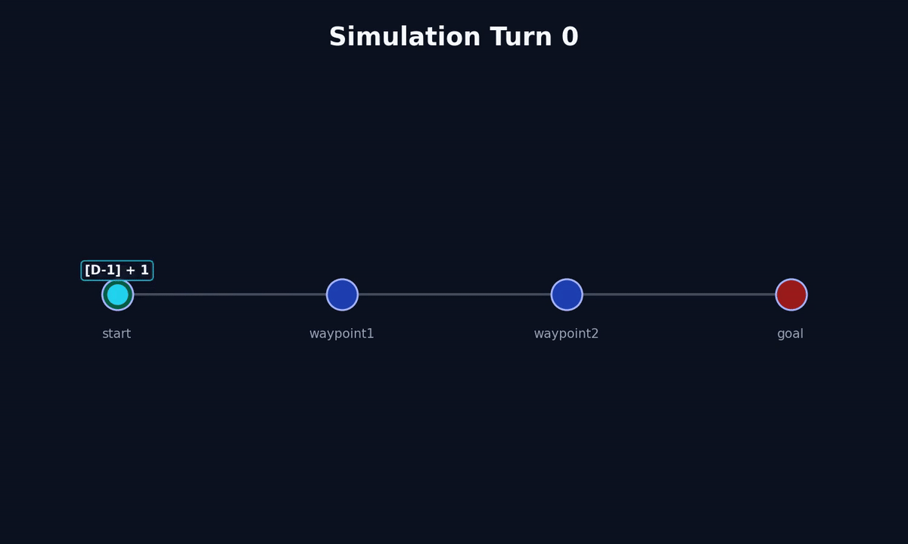
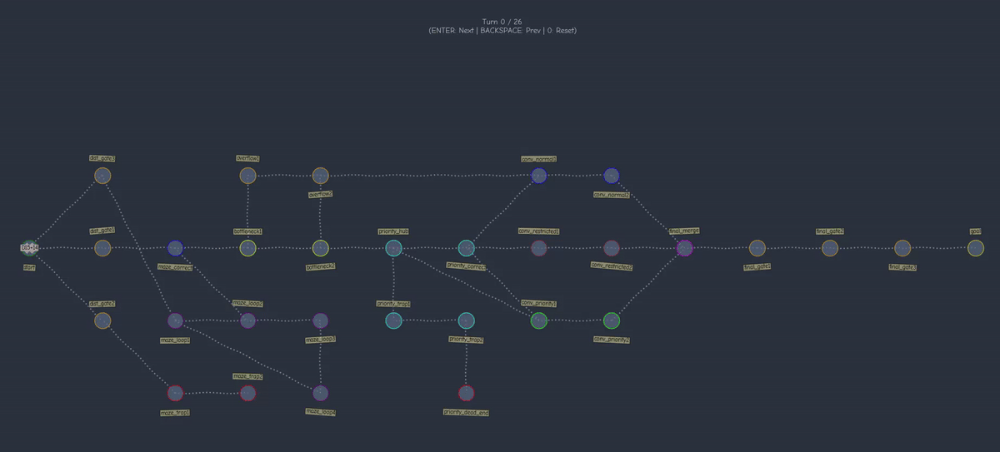
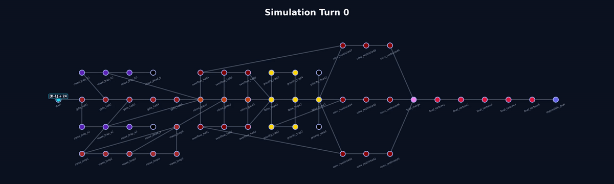

# Fly-in

> A space-time drone routing and simulation engine built in Python.

Fly-in is a multi-agent pathfinding simulator designed to route drones through a constrained graph environment while avoiding collisions in both space and time.

The project parses a custom map format, computes collision-free routes using a reservation-based pathfinding system, and visualizes the simulation interactively or through exported MP4 animations.

This project was developed as part of the 42 School curriculum.



---

# Features

- Custom map format parser
- Space-time pathfinding
- Multi-drone collision avoidance
- Restricted and priority zones
- Edge capacity constraints
- Interactive simulation viewer
- Smooth MP4 animation export
- Mermaid graph helper generator
- Type-checked Python codebase

---

# Project Structure

```text
.
├── src/
│   ├── __init__.py
│   ├── __main__.py
│   ├── data.py
│   ├── parsing.py
│   └── space_time_pathfinder.py
│
├── helper/
│   └── mermaid_helper.py
│
├── maps/
│   └── example.map
│
├── Makefile
├── README.md
└── pyproject.toml
```

---

# Installation

## Requirements

- Python 3.11+
- uv
- FFmpeg (optional, required for MP4 export)

---

## Install Dependencies

```bash
make install
```

or manually:

```bash
uv sync
```

---

# Running the Simulation

## Using Make

```bash
make run MAP="maps/example.map"
```

## Using Python

```bash
uv run python3 -m src maps/example.map
```

---

# Map Format

Fly-in uses a custom graph description language.

Example:

```txt
nb_drones: 3

start_hub: A 0 0 [color=green]
hub: B 2 0 [zone=priority]
hub: C 4 0
end_hub: D 6 0 [color=red]

connection: A-B
connection: B-C
connection: C-D
```

---

# Supported Zone Types

| Zone Type | Description |
|---|---|
| `normal` | Standard traversal node |
| `blocked` | Non-traversable node |
| `restricted` | Traversal requires additional time |
| `priority` | Preferred during routing |

---

# Supported Attributes

## Zones

| Attribute | Description |
|---|---|
| `color` | Visualization color |
| `max_drones` | Maximum simultaneous drone occupancy |
| `zone` | Zone type |

Example:

```txt
hub: X 10 4 [color=blue max_drones=2 zone=priority]
```

---

## Connections

| Attribute | Description |
|---|---|
| `max_link_capacity` | Maximum drones allowed simultaneously |

Example:

```txt
connection: A-B [max_link_capacity=2]
```

---

# Algorithm

Fly-in implements a simplified:

- Cooperative Pathfinding
- Space-Time Dijkstra Search

Each drone is routed sequentially while reserving:

- nodes over time
- edges over time

This prevents:

- node collisions
- edge conflicts
- restricted-zone overlap

The system maintains two reservation tables:

```python
node_reservations[(zone, turn)]
edge_reservations[(edge, turn)]
```

Each new drone computes a valid route while respecting all existing reservations.

---

# Restricted Zones

Restricted zones simulate expensive traversal.

Entering a restricted node:

- consumes additional turns
- reserves the connecting edge for multiple time steps

This creates realistic congestion behavior.

---

# Interactive Visualization

The project includes a built-in interactive visualizer powered by
Matplotlib.

Controls:

| Key | Action |
|---|---|
| `ENTER` | Next turn |
| `BACKSPACE` | Previous turn |
| `0` | Reset simulation |

---

# MP4 Animation Export

Fly-in can export smooth interpolated animations using FFmpeg.

Enable:

```python
self.visualize_tmp()
```

inside:

```python
PathFinder.looper()
```

Generated videos include:

- smooth drone interpolation
- dynamic labels
- scalable layouts
- congestion visualization

---

# Example Videos

## Simulation Demo



---

## Large Map Stress Test



---


# Mermaid Helper Script

A helper script is included to convert map files into Mermaid diagrams.

Run:

```bash
python map_to_mermaid.py maps/example.map
```

Example output:


Useful for quickly debugging graph topology.

---

# Development

## Linting

```bash
make lint
```

Includes:

- mypy
- flake8

---

## Debugging

```bash
make debug
```

---

## Cleaning Cache Files

```bash
make clean
```

---

# Technical Highlights

- Custom DSL parser
- Time-expanded graph traversal
- Reservation-based scheduling
- Dynamic graph visualization
- MP4 rendering pipeline
- Typed Python architecture

---

# Future Improvements

- Dynamic congestion costs
- GUI editor for maps
- Real-time simulation controls
- Better visualization batching
- Live statistics dashboard

---

# Example Output

```txt
D1-B D2-C
D1-C D2-D
D1-D
```

---

# Built With

- Python
- Matplotlib

---

# 42 School

This project was developed as part of the 42 School curriculum, focusing on:

- algorithms
- graph theory
- parsing
- simulation systems
- visualization
- software architecture
